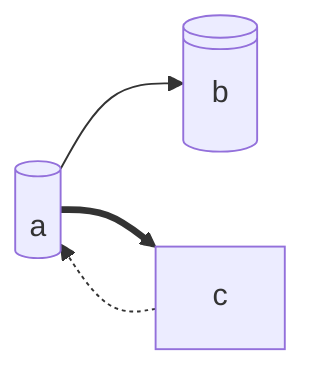
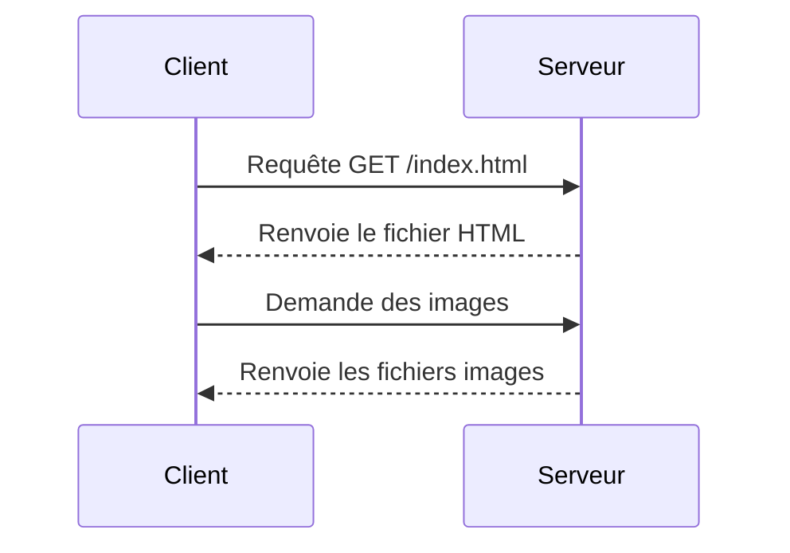
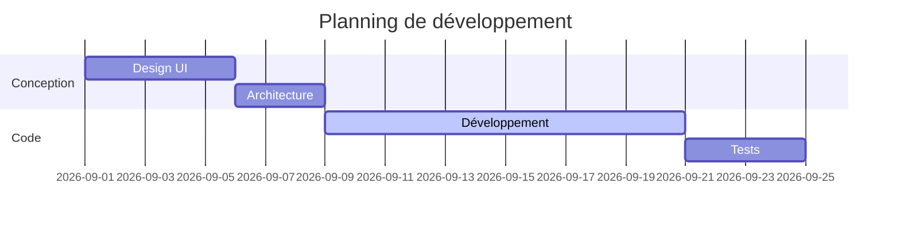
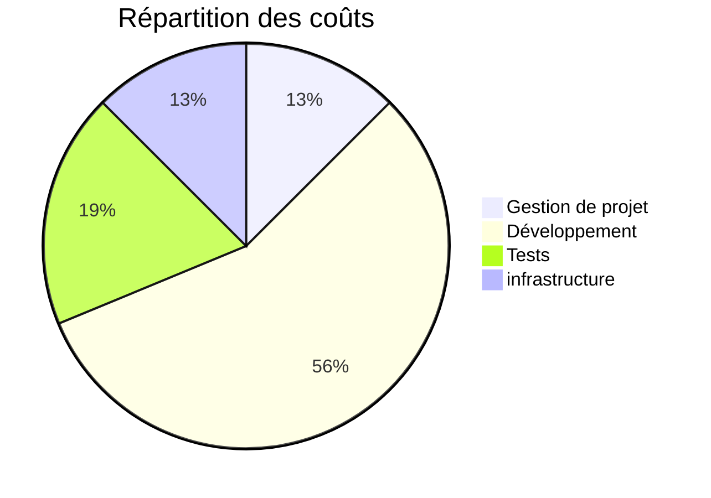

# TradeCorp Data Platform — Pipeline ETL cloud automatisé avec Spark, Docker et Airflow

## **Présentation:**

> TradeCorp International reçoit chaque nuit ses données commerciales sous  forme de fichiers CSV bruts, retraités manuellement en 3h chaque matin,  sans automatisation ni traçabilité. objectif, créer une pipeline ETL industrialisé : conteneurisation avec  Docker, centralisation des données dans un Data Lake Azure (ADLS Gen2),  enrichissement via API, transformations avec Apache Spark, sécurisation  des secrets via Azure Key Vault, et automatisation complète avec Apache  Airflow. Le projet se conclut par une présentation devant le comité de  direction.

## architecture:





présentation des entitées 

| col1 | col2 | col3 |
| - | - | - |
|1| 2 | 3 |
| 4 | 5 | 6 |

## stack:

> python:
> spark:
> docker:

## instructions d'installation et de lancement:

```bash
docker compose up -d
```

## Planning et coûts de développement:





