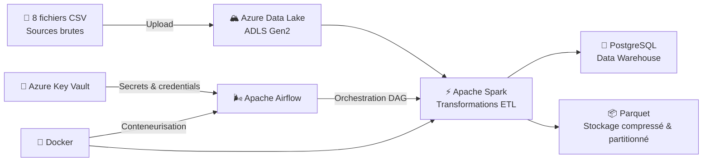
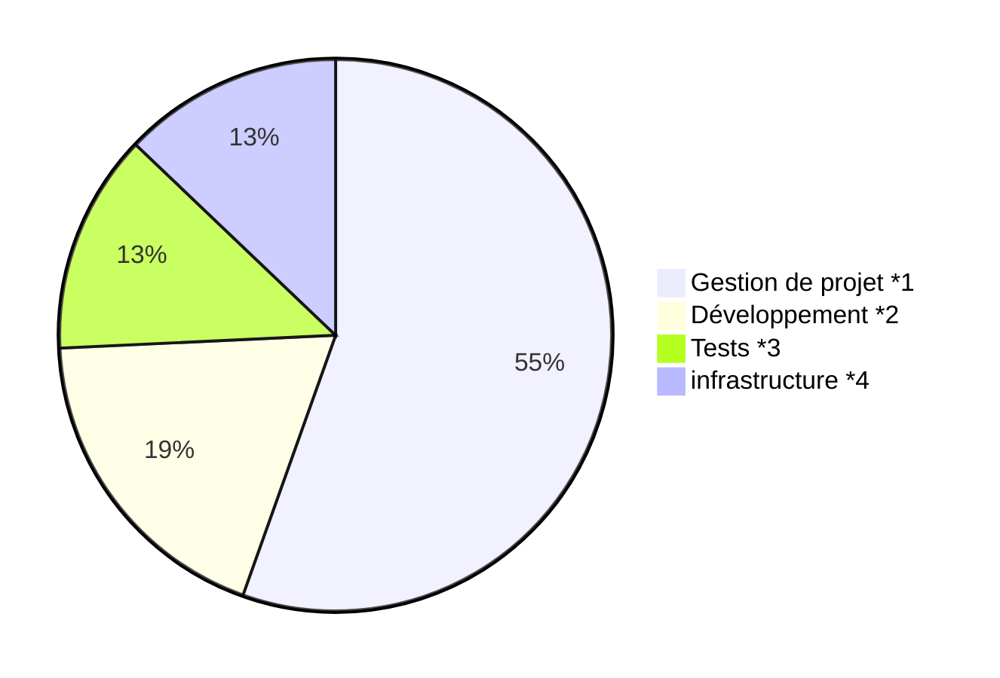

<ul align="center">
    <h1 align="center">☁️ TradeCorp Data Platform</h1>
    <p align="center">Pipeline ETL cloud automatisé avec Spark, Docker et Airflow</p>
    <ul align="center>
        
        
        
        
        
        
    </ul">
</ul>

## 📋 Table des matières

- [📋 Table des matières](#-table-des-matières)
- [🎯 Contexte et objectifs](#-contexte-et-objectifs)
- [🏗️ Architecture](#️-architecture)
- [🗃️ présentation des entitées](#️-présentation-des-entitées)
- [🛠️ Stack technique](#️-stack-technique)
- [🚀 Installation lancement et tests](#-installation-lancement-et-tests)
  - [Prérequis](#prérequis)
  - [1. Cloner le repository](#1-cloner-le-repository)
  - [2. Construire et démarrer la stack](#2-construire-et-démarrer-la-stack)
  - [3. Accéder aux services](#3-accéder-aux-services)
  - [4. Exécuter le pipeline](#4-exécuter-le-pipeline)
  - [5. Lancer les tests](#5-lancer-les-tests)
- [📅 Planning de développement](#-planning-de-développement)
- [💰 Répartition des coûts](#-répartition-des-coûts)

## 🎯 Contexte et objectifs

TradeCorp International reçoit chaque nuit ses données commerciales sous forme de **fichiers CSV bruts**, stockés manuellement. L'objectif est de créer une pipeline ETL complète et industrialisée :

- **Conteneurisation** avec Docker & Docker Compose
- **Stockage cloud** via Azure Data Lake Gen2
- **Transformations distribuées** avec Apache Spark
- **Sécurisation** des secrets via Azure Key Vault
- **Orchestration** et automatisation avec Apache Airflow

## 🏗️ Architecture



## 🗃️ présentation des entitées

| Fichier               | Description          | Colonnes clés                                                                                          |
| --------------------- | -------------------- | ------------------------------------------------------------------------------------------------------- |
| `orders.csv`        | Commandes clients    | `order_id`, `customer_id`, `order_date`, `shipped_date`, `freight`, `ship_via`              |
| `order_details.csv` | Lignes de commande   | `order_id`, `product_id`, `unit_price`, `quantity`, `discount`                                |
| `customers.csv`     | Fiche clients        | `customer_id`, `company_name`, `contact_name`, `country`                                        |
| `products.csv`      | Catalogue produits   | `product_id`, `product_name`, `category_id`, `unit_price`, `units_in_stock`, `discontinued` |
| `categories.csv`    | Catégories produits | `category_id`, `category_name`, `description`                                                     |
| `employees.csv`     | Employés            | `employee_id`, `first_name`, `last_name`, `title`, `hire_date`, `city`, `country`         |
| `shippers.csv`      | Transporteurs        | `shipper_id`, `company_name`, `phone`                                                             |
| `suppliers.csv`     | Fournisseurs         | `supplier_id`, `company_name`, `contact_name`, `country`                                        |

## 🛠️ Stack technique

| Catégorie                 | Outils                                       |
| -------------------------- | -------------------------------------------- |
| **Langage**          | Python 3.11                                  |
| **Big Data**         | Apache Spark 3.5, PySpark, Pandas            |
| **Stockage**         | Parquet, Azure Data Lake Gen2, PostgreSQL 15 |
| **Orchestration**    | Apache Airflow                               |
| **Conteneurisation** | Docker, Docker Compose                       |
| **Dev**              | JupyterLab, VS Code                          |
| **Tests**            | pytest                                       |
| **Sécurité**       | Azure Key Vault                              |
| **Documentation**    | Mermaid                          |

## 🚀 Installation lancement et tests

### Prérequis
- Docker

### 1. Cloner le repository

```bash
git clone https://github.com/<user>/TradeCorp_Data_Platform.git
cd TradeCorp_Data_Platform
```
### 2. Construire et démarrer la stack

```bash
docker compose up -d --build
```

### 3. Accéder aux services
- JupyterLab  → `http://localhost:8888`
-  Spark UI    → `http://localhost:4040`
- Airflow     → `http://localhost:8080`  (user: airflow / pass: airflow)
- pgAdmin     → `http://localhost:5050`

### 4. Exécuter le pipeline

depuis le conteneur Spark

```bash
docker exec -it tradecorp_spark spark-submit /home/jovyan/src/pipeline.py
```

### 5. Lancer les tests

```bash
docker exec tradecorp_spark pytest /home/jovyan/tests/ -v
```


## 📅 Planning de développement

```
https://github.com/users/indidi01/projects/1/views/4
```

## 💰 Répartition des coûts


*1. Pilotage, reporting, documentation, présentation
*2. Code Spark, modules Python, notebooks
*3. Tests unitaires, validation des données
*4.  Docker, Azure, PostgreSQL, monitoring